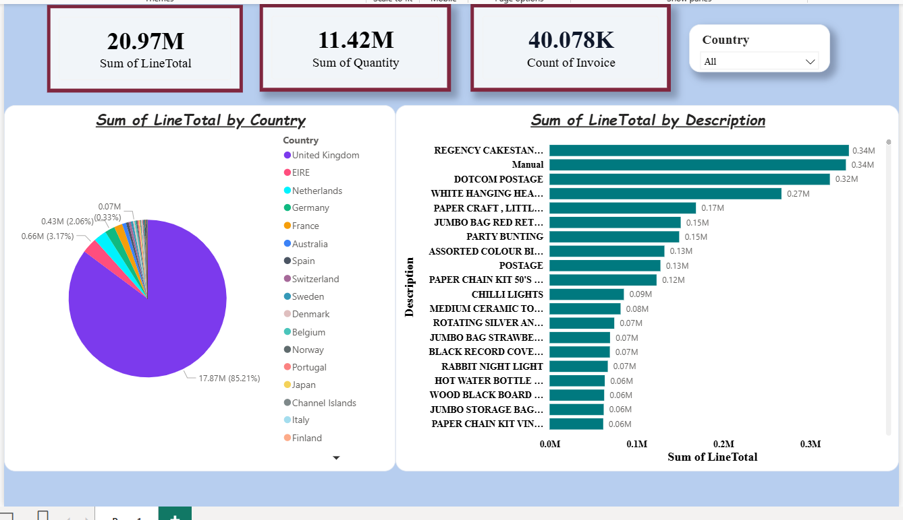

# E-Commerce End-to-End Data Pipeline & Analytics

## 📊 Project Overview
An end-to-end data engineering and business intelligence project that automates the extraction, transformation, and loading (ETL) of raw retail transactional data. The project orchestrates data ingestion through a Jupyter Notebook, structures it within a local SQLite database, validates operations via custom SQL queries, and visualizes health metrics in an interactive executive sales dashboard.

## 📷 Dashboard Preview

## 📂 Repository File Structure
* **`etl_pipeline.ipynb`**: Interactive Python Notebook detailing the extraction, cleaning, and transformation logic using Pandas.
* **`ecom_data.db`**: Structured local SQLite database holding the finalized, high-velocity clean relational tables.
* **`queries.sql`**: Production-ready SQL scripts used to query, validate, and audit database health metrics.
* **`ECom_Sales_Dashboard.pbix`**: Interactive Power BI dashboard designed with a modern SaaS custom interface.
* **`ecom_preview.png`**: High-resolution screenshot showcasing the dynamic dashboard interface.

## 🛠️ Tech Stack & Skills
* **Language/Environment:** Python 3.x, Jupyter Notebooks (Pandas, SQLite3)
* **Database Management:** SQL, SQLite (Relational modeling, constraint validation)
* **Business Intelligence:** Power BI Desktop (Custom JSON theme design, canvas layout)
* **Core Competencies:** ETL pipeline development, schema design, data cleaning, diagnostic analytics

## ⚙️ Data Pipeline Architecture (ETL)
1. **Extraction:** Ingests unformatted transactional data from source structures into a clean DataFrame environment.
2. **Transformation (`etl_pipeline.ipynb`):** 
   * Trims trailing spaces, rectifies data type mismatches, and drops missing target attributes.
   * Isolates and structures core dimension metrics (Invoice, Stock Details, Pricing).
   * Generates calculated values such as operational line totals.
3. **Loading:** Bridges data to **`ecom_data.db`**, updating database indexes for query optimization.
4. **Validation (`queries.sql`):** Executes complex SQL aggregates to cross-verify database row totals against dashboard inputs.

## 💡 Key Business Insights Captured
* **Geographic Breakdown:** Evaluates market share concentration across global markets, tracking primary revenue engines.
* **Product Performance Analytics:** Aggregates transaction velocity by stock description to reveal inventory moving patterns.
* **Sales Volume Dynamics:** Monitors high-level operational health indicators across millions in revenue, tracking total item quantities and invoice distributions.
